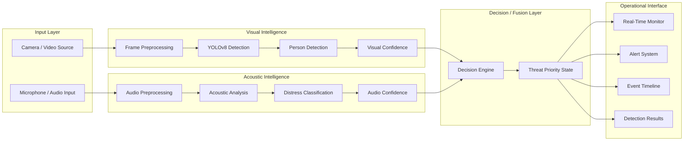
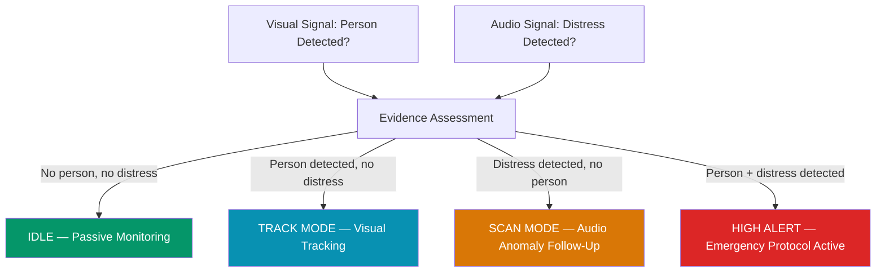

# Multimodal AI Rescue Detection System

**Vision + Acoustic Intelligence for AI-Assisted Rescue Event Detection**

A research-oriented prototype exploring multimodal rescue-event assessment by combining visual person detection, acoustic distress analysis, and real-time operational monitoring through a unified decision framework.

<br/>


---

## Overview

This project investigates whether rescue-event assessment can benefit from combining complementary signal modalities rather than relying on a single source of evidence.

**Visual evidence** may indicate that a person is present, being tracked, and potentially a rescue target. **Acoustic evidence** may indicate distress, screaming, or localized calls for help. When fused through a decision engine, these complementary signals can produce richer contextual evidence for operational assessment than either modality alone.

The system includes:

- **YOLOv8-based visual detection** — person detection with configurable confidence thresholds
- **Acoustic signal monitoring** — real-time audio confidence tracking and visualization
- **Prototype multimodal decision engine** — rule-based fusion combining visual and acoustic signals into operational threat states
- **React monitoring interface** — a full operational dashboard with real-time monitoring, media testing, and acoustic analysis pages
- **FastAPI backend** with WebSocket support for real-time detection streaming

The project is under active development as a research prototype. The frontend currently operates with simulated detection signals for development and UI evaluation, while the ML pipeline contains a functional YOLOv8 detection system designed for real video inference.

---

## Why Multimodal Rescue Detection?

Relying on a single sensory channel introduces inherent limitations for rescue-event assessment.

| Signal | What It Contributes | Limitation |
|---|---|---|
| **Vision** | Person presence, spatial context, and tracking data | Occlusion, visibility conditions, and inability to determine distress |
| **Audio** | Distress-related acoustic evidence (screams, calls for help) | Environmental noise, localization difficulty, and lack of spatial context |
| **Multimodal** | Combined contextual evidence for richer assessment | Requires reliable fusion strategy and synchronized processing |

A system observing both visual and acoustic channels can potentially cross-reference signals — a detected person accompanied by distress audio provides stronger evidence for a rescue event than either signal in isolation.

---

## System Architecture



> **Note:** The Decision/Fusion Layer currently uses a rule-based prototype strategy. Learned fusion approaches are a planned research direction.

---

## Rescue Decision Workflow

The prototype decision engine evaluates combined visual and acoustic signals to assign operational threat states:



| Operational State | Trigger Condition | Action |
|---|---|---|
| **IDLE** | No person and no distress signal | Passive monitoring continues |
| **TRACK MODE** | Person detected, audio stable | Visual target tracking initiated |
| **SCAN MODE** | Distress audio without person lock | Elevated scan mode for audio anomaly |
| **HIGH ALERT** | Person detected + distress audio | Emergency protocol, snapshot capture, alert triggered |

---

## Core System Modules

### 1. Visual Intelligence

The `ml/detector.py` module implements a YOLOv8-based detection pipeline:

- **Model**: YOLOv8s via the Ultralytics library
- **Detection target**: Person class only (`classes=[0]`)
- **Input sources**: Webcam (with platform-specific fallbacks including AVFoundation on macOS), video files, or sample videos from `assets/sample_videos/`
- **Inference**: Configurable image size (default 640) and confidence threshold (default 0.4)
- **Streaming**: Annotated frames with bounding boxes and confidence labels are encoded to base64 JPEG and published to the backend via WebSocket or REST
- **Display**: Optional OpenCV window for local visualization

A `ml/dummy_model.py` provides a simulated detection adapter for testing the pipeline without a GPU or YOLO installation.

### 2. Acoustic Intelligence

The Audio page (`frontend/src/pages/Audio.jsx`) provides an interface for acoustic signal monitoring:

- **Confidence tracking**: Real-time audio confidence values plotted on a Recharts line graph
- **Status classification**: NORMAL / POSSIBLE / SCREAM based on confidence thresholds
- **Operational states**: MONITORING → ANALYZING → TRACKING → ALERT → CRITICAL with visual feedback
- **Event feed**: Timestamped acoustic events with color-coded severity
- **Controls**: Start/stop listening toggle

> **Implementation note:** The acoustic confidence values in the frontend are currently generated by a simulated waveform function (`generateConfidence` using sinusoidal patterns with noise) for UI development and evaluation. Integration with a real audio classification backend is a planned development step.

### 3. Multimodal Decision Layer

The prototype decision engine (`resolveDecision` in `RealTime.jsx`) implements a rule-based fusion strategy:

- Combines boolean `personDetected` and `screamDetected` signals
- Maps the combination to one of four operational states: IDLE, TRACK MODE, SCAN MODE, HIGH ALERT
- Drives global threat context via `ThreatContext` for UI-wide visual reactivity
- Generates escalation and recovery events in the operational timeline

The `ThreatContext` propagates threat state across the entire interface, affecting ambient visual effects, alert banners, color intensity, and background orb animations.

### 4. Operational Monitoring Interface

The React frontend serves as an operator-facing research dashboard with three primary operational pages:

**Real-Time Monitor** (`/`)
- Drone heads-up display with simulated detection overlay
- Decision panel showing threat state, reasoning, and modality signals
- Event timeline with color-coded detection, scream, alert, and system events
- Metrics panel (detection rate, average confidence, alerts triggered, system latency)
- Snapshot evidence capture with alert-triggered image generation
- Map panel with target position tracking
- System status indicators (camera, audio, model, GPS)
- Operator controls (AI enable/pause, sensitivity slider, detection threshold)
- Sound control with alert audio patterns (repeating alert, short beep, silent)
- Threat-reactive ambient visual effects throughout the interface

**Image / Video Testing** (`/testing`)
- Media upload for images and video files
- Preview panel with file type detection
- Simulated detection workflow with bounding overlay rendering
- Result panel with detection summary

**Audio Detection** (`/audio`)
- Start/stop acoustic monitoring controls
- Real-time confidence line graph (Recharts)
- Audio status indicators with detection classification
- Operational state-reactive event feed with color-coded severity
- Confidence metric cards

> **Important:** The Real-Time Monitor and Audio pages currently operate with simulated detection signals for UI development and evaluation. The Testing page uses a hardcoded mock detection result. These pages demonstrate the intended operational workflow and are designed for integration with real backend inference outputs.

---

## Implementation Status

| Component | Status | Description |
|---|---|---|
| React monitoring dashboard | ✅ Implemented | Full operational interface with three pages, sidebar navigation, threat-reactive theming |
| FastAPI backend | ✅ Implemented | REST API with health, detection, and WebSocket endpoints |
| WebSocket real-time streaming | ✅ Implemented | ML-to-backend frame streaming via WebSocket with REST fallback |
| YOLOv8 person detection | ✅ Implemented | YOLOv8s pipeline with webcam/video input, configurable thresholds, annotated output |
| Dummy/simulated model | ✅ Implemented | Simulated detection adapter for testing without GPU |
| Decision engine (rule-based) | 🧪 Prototype | Four-state fusion logic combining person and scream signals |
| Audio monitoring UI | 🧪 Prototype | Interface with simulated confidence waveforms for development |
| Threat-reactive UI system | 🧪 Prototype | Global threat context driving visual effects across the interface |
| Image/video testing page | 🧪 Prototype | Upload and preview workflow with mock detection results |
| Simulated Real-Time signals | 🧪 Prototype | Sinusoidal mock scenarios for person/scream detection in dashboard |
| Bengali "Bachao" dataset | 🚧 In Development | Localized distress speech data collection and curation |
| Acoustic classifier training | 📋 Planned | Real scream/distress classification model |
| Backend audio inference endpoint | 📋 Planned | Server-side audio processing and classification |
| Multimodal fusion (learned) | 📋 Planned | ML-based fusion strategy replacing rule-based approach |
| Physical drone integration | 📋 Planned | Edge deployment on drone hardware |

---

## Technology Stack

| Layer | Technologies |
|---|---|
| **Frontend** | React 18, Vite 5, Tailwind CSS 3, Framer Motion, Recharts, Zustand, Lucide React |
| **Backend** | Python, FastAPI, Uvicorn, Pydantic, Websockets |
| **Computer Vision** | Python, Ultralytics YOLOv8, OpenCV |
| **Real-Time Communication** | WebSocket (frontend ↔ backend ↔ ML pipeline) |
| **State Management** | Zustand (client), React Context (ThreatContext, OperationalStateContext) |
| **Build & Tooling** | Vite, PostCSS, Autoprefixer, npm |
| **ML Inference** | Ultralytics YOLOv8, OpenCV, Base64 JPEG encoding |

---

## Project Structure

```
Multimodal-AI-Rescue-Detection-System/
├── frontend/                        # React monitoring interface
│   ├── src/
│   │   ├── pages/
│   │   │   ├── RealTime.jsx         # Real-time monitoring dashboard
│   │   │   ├── Testing.jsx          # Image/video detection testing
│   │   │   └── Audio.jsx            # Acoustic detection interface
│   │   ├── components/
│   │   │   ├── DroneHUD.jsx         # Cinematic drone heads-up display
│   │   │   ├── DecisionPanel.jsx    # Threat state and reasoning display
│   │   │   ├── EventTimeline.jsx    # Detection/alert event feed
│   │   │   ├── AudioGraph.jsx       # Recharts confidence visualization
│   │   │   ├── MapPanel.jsx         # Target position map
│   │   │   ├── SnapshotPanel.jsx    # Alert evidence capture
│   │   │   ├── SystemStatus.jsx     # Subsystem health indicators
│   │   │   ├── AISystemBoot.jsx     # Boot animation overlay
│   │   │   ├── GlobalAlertBanner.jsx # Alert notification system
│   │   │   └── ...                  # 30+ UI components
│   │   ├── context/
│   │   │   ├── ThreatContext.jsx     # Global threat state propagation
│   │   │   └── OperationalStateContext.jsx
│   │   ├── hooks/
│   │   │   ├── useMockAlertCycle.js # Simulated alert cycling
│   │   │   ├── useAlertReaction.js  # Alert behavior hooks
│   │   │   └── useTheme.js          # Dark/light theme management
│   │   ├── store/
│   │   │   └── alertState.js        # Zustand alert state store
│   │   ├── services/
│   │   │   ├── api.js               # Backend API client
│   │   │   └── socket.js            # WebSocket client
│   │   ├── App.jsx                  # Root app with routing
│   │   └── main.jsx                 # Application entry point
│   ├── package.json
│   ├── vite.config.js
│   └── tailwind.config.js
├── backend/                         # FastAPI backend server
│   ├── main.py                      # Application entry point
│   ├── routes/
│   │   ├── detection.py             # Detection API endpoints
│   │   └── health.py                # Health check endpoint
│   ├── services/
│   │   └── detection_service.py     # Detection processing logic
│   ├── utils/
│   │   └── ml_bridge.py             # ML pipeline integration
│   ├── websocket/
│   │   └── manager.py               # WebSocket connection management
│   └── requirements.txt
├── ml/                              # Machine learning pipeline
│   ├── detector.py                  # YOLOv8 detection pipeline with streaming
│   ├── dummy_model.py               # Simulated detection model for testing
│   └── requirements.txt
├── assets/
│   └── sample_videos/               # Fallback video samples for detection
├── run_all.sh                       # System launcher script
├── .env.example                     # Environment configuration template
└── README.md
```

---

## Getting Started

### Prerequisites

- **Node.js** 18+ and npm
- **Python** 3.10+
- **pip**
- (Optional) A webcam for live detection testing

### 1. Clone the Repository

```bash
git clone https://github.com/mohammad-sayem-uddin/Multimodal-AI-Rescue-Detection-System.git
cd Multimodal-AI-Rescue-Detection-System
```

### 2. Frontend Setup

```bash
cd frontend
npm install
npm run dev
```

The dashboard will be available at `http://localhost:5173`.

### 3. Backend Setup

```bash
cd backend
python -m venv venv
source venv/bin/activate        # macOS / Linux
# venv\Scripts\activate         # Windows

pip install -r requirements.txt
uvicorn main:app --reload --port 8000
```

The API will be available at `http://localhost:8000`.

### 4. ML Pipeline Setup (Optional)

For real YOLO detection:

```bash
cd ml
python -m venv venv
source venv/bin/activate
pip install -r requirements.txt
```

Run the detector with a webcam:

```bash
python detector.py --source 0 --display
```

Run with a video file:

```bash
python detector.py --source path/to/video.mp4 --backend-mode websocket
```

Additional options:

```bash
python detector.py --help
```

### 5. Environment Configuration

```bash
cp .env.example .env
```

Edit `.env` to configure backend URLs and other settings as needed.

### 6. Using the Launcher Script

```bash
chmod +x run_all.sh
./run_all.sh
```

---

## Model Weights

The repository intentionally excludes model weight files (`*.pt`, `*.pth`, `*.onnx`, `*.h5`). The default configuration uses `yolov8s.pt`, which is automatically downloaded by the Ultralytics library on first run. Custom model paths can be specified via the `--model-path` CLI argument or the `YOLO_MODEL_PATH` environment variable.

---

## Dataset Strategy

Large-scale datasets are intentionally excluded from this repository. The broader research direction involves:

- **Visual data**: Consolidating and cleaning aerial/rescue-oriented visual data from multiple public sources for person detection in rescue scenarios
- **Acoustic data**: Utilizing public scream/distress audio datasets where licensing permits
- **Localized speech**: Collecting and curating a custom Bengali distress speech dataset (see below)

No datasets are distributed with this repository. Dataset preparation is handled separately as part of the research workflow.

---

## Localized Distress Recognition: "Bachao" (বাঁচাও)

"Bachao" (বাঁচাও) is a Bengali expression commonly used to call for help, directly translating to "Save me." This project includes a research direction to investigate localized verbal distress recognition as an acoustic signal for rescue-event assessment.

The goal is to develop a context-aware acoustic component relevant to Bengali-speaking environments, where recognizing culturally specific distress vocabulary could contribute meaningful evidence to a multimodal rescue detection pipeline.

> **Current status:** A custom "Bachao" dataset is in the early stages of development. No trained classifier exists yet.

---

## Research Direction

This project is guided by the following research questions:

1. **Multimodal fusion effectiveness** — Can complementary visual and acoustic evidence improve rescue-event assessment compared with relying on a single modality?

2. **Aerial person detection robustness** — How reliably can YOLO-based person detection perform under challenging rescue-oriented visual conditions such as low resolution, partial occlusion, and variable lighting?

3. **Localized distress recognition** — Can recognizing culturally specific verbal distress signals, such as the Bengali "Bachao," contribute useful acoustic evidence to a rescue-detection pipeline?

4. **Fusion strategy design** — How should visual and acoustic confidence scores be combined to reduce false alerts while preserving sensitivity to genuine distress events?

---

## Planned Evaluation

Future evaluation aims to compare three operational configurations:

**Vision-only** — Person detection without acoustic input
- Metrics: Precision, Recall, mAP

**Audio-only** — Distress classification without visual input
- Metrics: Accuracy, Precision, Recall, F1-score, Confusion Matrix

**Multimodal fusion** — Combined visual and acoustic evidence
- Metrics: Alert Precision, Alert Recall, False Alert Rate, Ablation Comparison

> These are planned evaluation targets. No experimental results are reported at this stage.

---

## Current Limitations

- **Research prototype** — The system is a development-stage prototype, not a production deployment
- **Simulated dashboard signals** — The Real-Time Monitor and Audio pages currently use simulated detection data for UI development and evaluation
- **No physical drone deployment** — The system has not been deployed on physical drone hardware
- **Multimodal fusion under development** — The current decision engine uses rule-based logic; learned fusion approaches are planned
- **Acoustic classifier pending** — Real scream/distress classification is not yet integrated; the audio pipeline currently uses simulated confidence values
- **Localized dataset in progress** — The Bengali "Bachao" distress dataset is in early development
- **Environmental robustness** — Real-world performance under diverse conditions requires systematic evaluation

---

## Roadmap

- [x] Build operational React monitoring interface with three dedicated pages
- [x] Integrate YOLOv8 visual detection pipeline with webcam and video support
- [x] Implement FastAPI backend with REST and WebSocket endpoints
- [x] Develop real-time ML-to-frontend detection streaming
- [x] Build acoustic monitoring interface with confidence visualization
- [x] Implement rule-based multimodal decision engine
- [x] Create threat-reactive UI system with global state propagation
- [ ] Integrate real acoustic classification backend
- [ ] Complete Bengali "Bachao" dataset collection and curation
- [ ] Train and evaluate localized distress classifier
- [ ] Implement learned multimodal fusion strategy
- [ ] Connect frontend to live backend inference outputs
- [ ] Perform comparative experiments (vision-only vs. audio-only vs. multimodal)
- [ ] Evaluate under challenging environmental conditions
- [ ] Explore edge deployment on drone hardware

---

## Disclaimer

This is a research and development prototype. It is not a certified emergency-response system and should not be relied upon as the sole mechanism for life-critical decisions. Real-world deployment would require extensive validation, safety engineering, and regulatory consideration.

---

## Contributing

Research collaboration and technical contributions are welcome. If you are interested in contributing, please open an issue to discuss your proposal or reach out directly.

---

## License

Copyright © 2025. All rights reserved unless a license is added in the future.

---

## Acknowledgments

- [Ultralytics](https://github.com/ultralytics/ultralytics) — YOLOv8 object detection framework
- [React](https://react.dev/) — Frontend user interface library
- [FastAPI](https://fastapi.tiangolo.com/) — Backend web framework
- [OpenCV](https://opencv.org/) — Computer vision library
- [Recharts](https://recharts.org/) — Data visualization library
- [Tailwind CSS](https://tailwindcss.com/) — Utility-first CSS framework